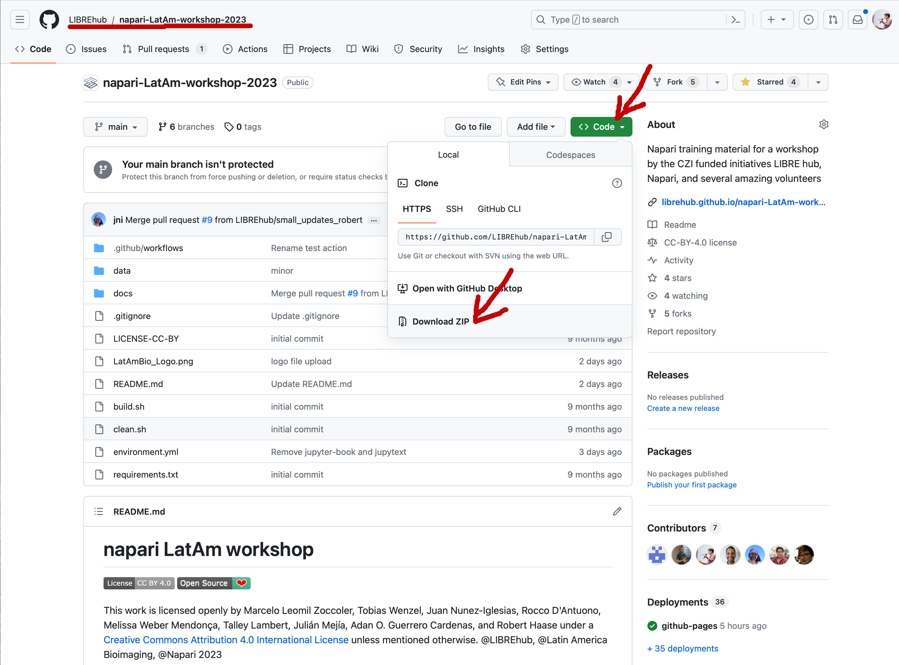
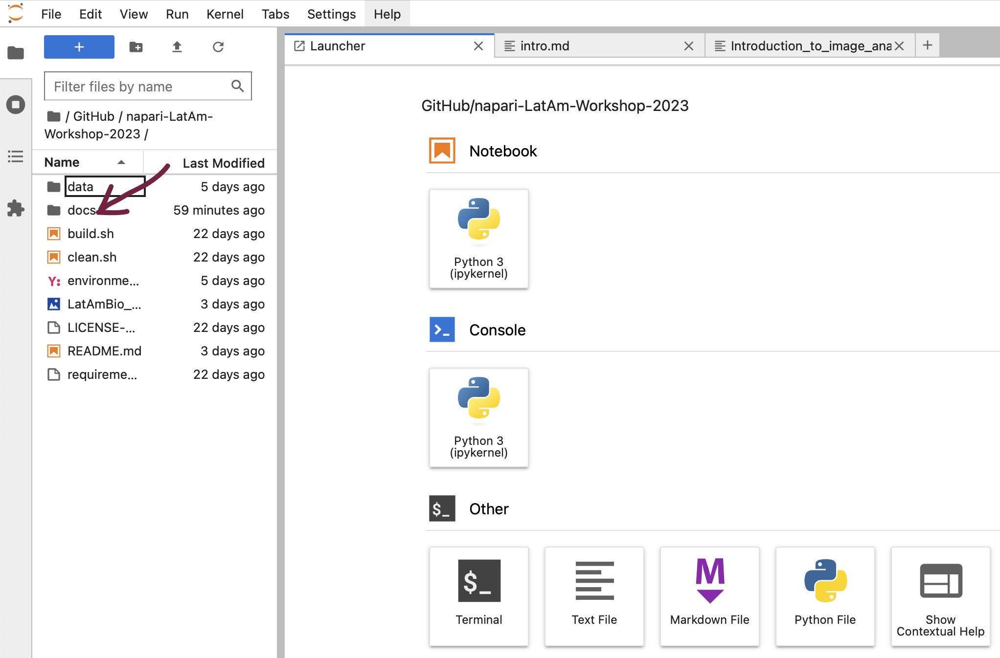
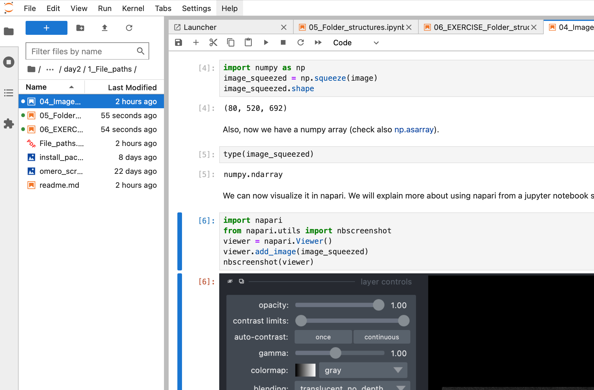

# Image data science for with Python and Napari

A first Latin America workshop #LIBREhub @napari #MexicoBioimaging

This [Jupyter book](https://jupyterbook.org/) contains training resources for scientists who want to dive into image processing with Python and Napari. 
It specifically aims for scientists and students working with microscopy images in the life sciences.
We presume the attendees have some basic python programming and image analysis knowledge. 
To get everyone on the same level, we start with Python programming basics.
We will process images using [numpy](https://numpy.org), [scipy](https://www.scipy.org/), [scikit-image](https://scikit-image.org/), [SimpleITK](https://simpleitk.org/) and [clEsperanto](https://github.com/clEsperanto/pyclesperanto_prototype).
We will explore [Napari](https://napari.org) for interactive image data analysis and the [Napari-Assistant](https://github.com/haesleinhuepf/napari-assistant) for generating [Jupyter Notebooks](https://jupyterlab.readthedocs.io/en/stable/) from interactively designed image processing workflows. 

**Note:** 
Before the course starts, all partcipants are required to have Napari and Jupyter installed, [please see the course preparation page](https://librehub.github.io/napari-LatAm-workshop-2023/day0/pre-requirements/to_be_installed.html) - and make use of the [napari chatroom for troubleshooting](https://napari.zulipchat.com/#narrow/stream/393209-napari-latam-workshop-2023/) if you face installation issues.


## Preliminary timetable (subject to adjustments)

All following times are in Chilean (Santiago) time. [Look up your related time here](https://timezonewizard.com/tn-75s), so you don't miss anything.


On the third and last day, there are showcase seminars of key napari plugins as well as emerging trends to controll your bioimaging hardware with python libraries


## How to use this material

For following the course, we recommend downloading [the repository from which this Jupyter book is made](https://github.com/LIBREhub/napari-LatAm-workshop-2023).
All Jupyter Notebooks are executable so that attendees can reproduce all demos and exercises.



Assuming you downloaded the repository to your Desktop, you can open the Jupyter book by opening a terminal and typing:

```bash
cd Desktop/napari-LatAm-Workshop-2023

conda activate devbio-napari-env

jupyter lab
```
If you do not yet have conda or devbio-napari-env installed, first follow the "Course preparation" installation instructions on the next page.

Using Jupyter lab, you can navigate to the course lessons in the `docs` folder.


... and execute the code and experiment with it.


## Feedback and support

If you have any questions, please create a [github issue](https://librehub.github.io/napari-LatAm-Workshop-2023/issues).
Alternatively, open a thread on [image.sc](https://image.sc).

## Acknowledgements

This course was held virtually at the IIBM, Universidad Católica de Chile in August 2023 as part of the LIBRE hub project. We would like to thank all online contributors and speakers for their support and CZI financial support through the LIBRE hub project. 
We would like to thank all the people who shared teaching materials we are reusing here, in particular from an [EPFL copurse last year](https://github.com/BiAPoL/Image-data-science-with-Napari-and-Python-LatAm2023).


